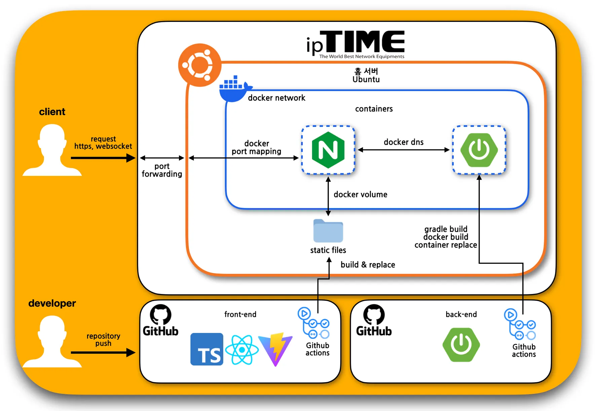

# Click Meee

## 서비스 아키텍처

## 기능
### 인트로

### 방 목록

### 방 생성

### 방

### 게임

### 게임 결과

## 기능 목록

1. 사이트에 접속하면, 인트로가 재생된다.
2. 방 목록을 확인할 수 있다.
    - 방 목록은 1초마다, 폴링을 통해서 갱신한다.
3. 방을 생성할 수 있다.
    - 방장의 닉네임을 설정하고 방을 생성할 수 있다.
        - 닉네임을 설정하지 않는다면, 우측 상단에 메시지가 출력된다.
    - 게임 유형은 다음과같다.
        - 1대1 : 두 명의 사람이 서로 경쟁한다.
        - 일대다 : 한 명의 사람과 여러명의 사람(팀)이 경쟁한다. 한 명의 사람은 클릭의 배율을 설정할 수 있다.
            - 팀의 인원수는 최대 99명이다.
        - 팀대팀 : 여러명의 사람과 여러명의 사람이 경쟁한다.
            - `2 vs 2 ~ 4 vs 4`까지로 구분되어 있다.
        - 개인전 : 여러 사람이 서로 경쟁한다.
4. 방
    - 방에서는 방 링크를 복사할 수 있다.
    - 방에서는 방 코드를 복사할 수 있다.
    - 방에서 자신의 팀을 이동할 수 있다.
    - 모든 인원의 준비가 완료되면 게임을 시작할 수 있다.
    - 방장은 왕관으로 표시된다.
    - 방장이 게임에서 나가면, 1초 후 모든 팀원들도 메인 페이지로 이동된다.
5. 방 입장
    - 방 코드를 통해 방에 입장할 수 있다.
    - 방 링크를 통해 방에 입장할 수 있다.
    - 방 목록을 통해 방에 입장할 수 있다.
    - 방에 입장하는 경우, 해당 방에서 사용할 닉네임을 설정하고 진입한다.
6. 게임
    - 게임이 시작되면 4초의 카운트 이후, 플레이어들은 버튼을 클릭하여 점수를 획득할 수 있다.
        - 클릭 배율이 적용되어 있다면, 클릭배율만큼 점수를 획득한다.
        - 버튼 클릭시 사운드가 재생된다.
        - 버튼 클릭시 버튼에 파동 이펙트가 표현된다.
    - 좌측 상단의 그래프에서는, 각 팀별 점수 그래프가 출력되고 개인전에서는 각 유저의 점수가 그려진다.
    - 우측 상단의 그래프에서는, 플레이어 자신의 점수 그래프가 출력된다.
    - 우측 상단의 그래프 아래에는 각 팀별 순위가 출력되고 개인전에서는 각 유저의 순위가 출력된다.
    - 그래프의 갱신은 매 1초마다 갱신된다.
7. 게임 결과
    - 진행중
